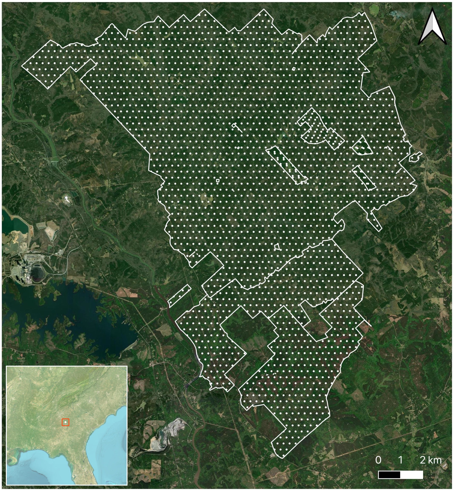
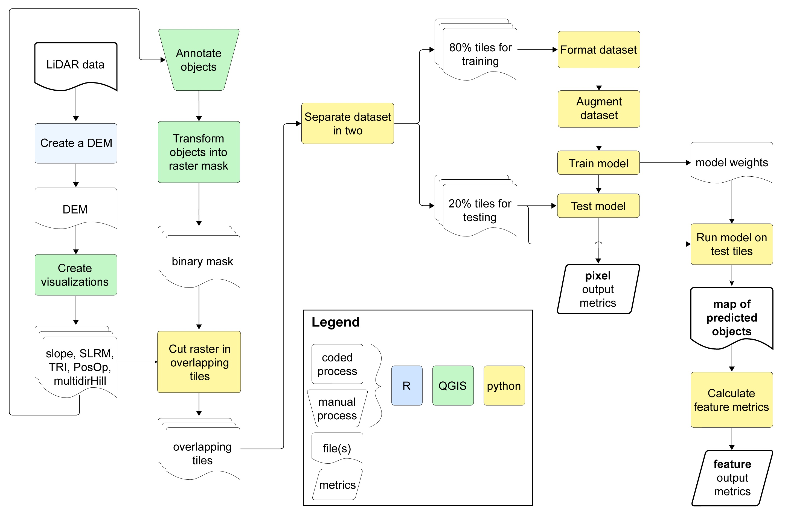
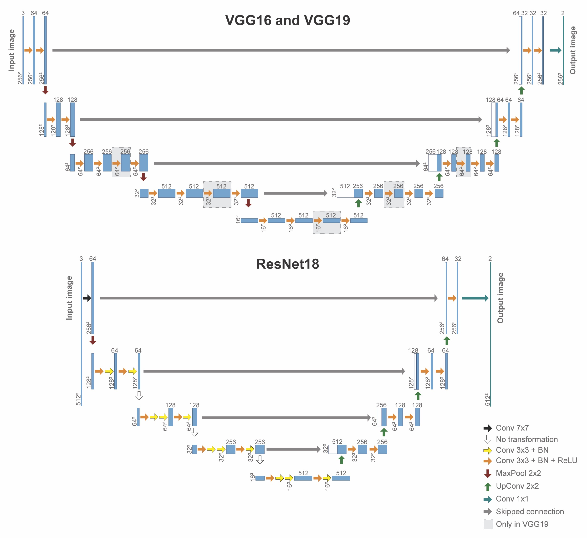
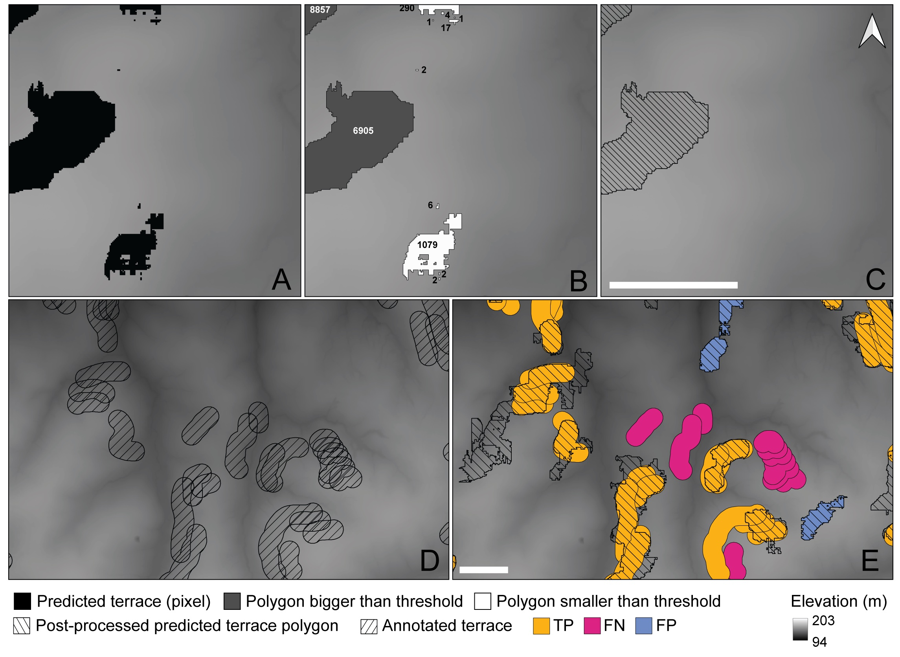
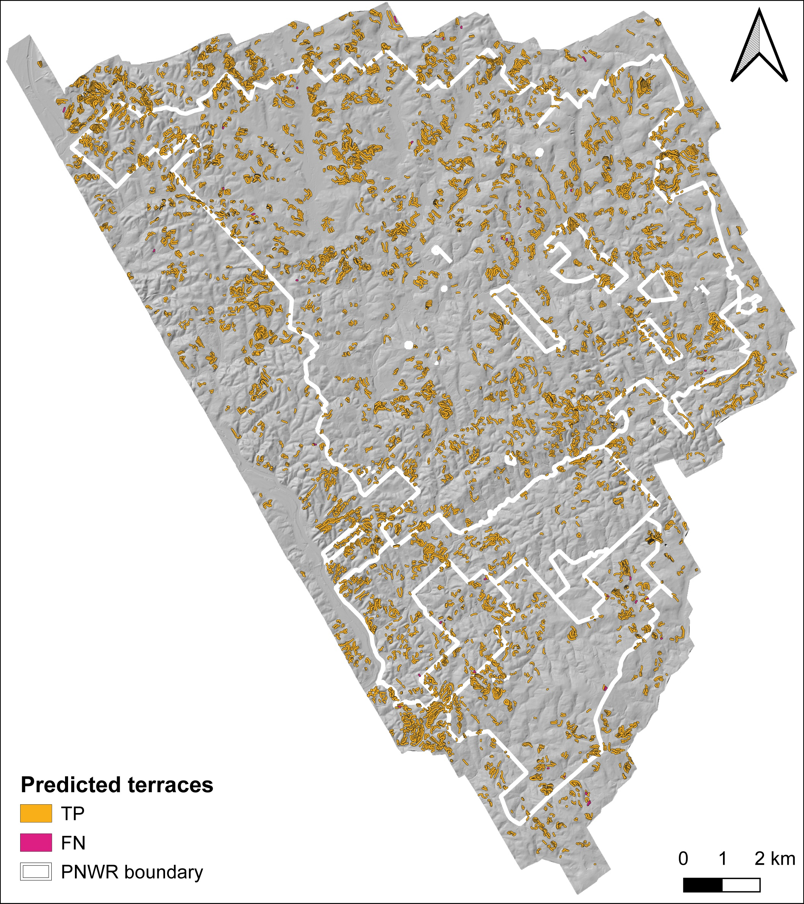

# Semantic segmentation of historial terraces on public lands
## Description
This repository holds the code we used for our study of historical cotton terraces within the Piedmont National Wildlife Refuge (PNWR), Georgia, USA



The scripts allows training a UNet that can take 3 different pre-trained backbones (VGG16, VGG19, and ResNet18)

## Installation
The scripts included here require Python 3.10 maximum. This workflow uses the following packages: `pandas`, `rasterio`, `shapely`, `geopandas`, `matplotlib`, `scikit-learn`, `scikit-image`, `tensorboard`, `torch_snippets`, `albumentations`, `torchmetrics`, `pycocotools`, and `tifffile`.

## File organization
These scripts require this specific file organization of input and output folders, as it uses hard-coded relative paths that follow this structure:

```bash
├── CNN_data
│   ├── CNN_input
│   │   ├── Grids
│   │   ├── Input_[vis name]_[tile size]
│   │   ├── [Object name mask subfolder]
│   │   │   ├── Target_[buffer size]_[tile_size]
│   ├── CNN_output
│   │   ├── Model_predictions
│   │   ├── Model_weights
│   ├── Visualizations_and_annotations
│   │   ├── Rasters
│   │   ├── Shapefiles
```

where:\
`[Object name mask subfolder]` can be anything that relates to the object to detect (e.g., *Terrace_masks*),\
`[vis name]` is the name of the visualization type, **without spaces** (e.g., *SLRM20m*),\
`[tile size]` is the height/width of the tiles (e.g., *256*), and\
`[buffer_size]` is the buffer around the annotated object, **without spaces** (e.g., *10m*)

## Workflow
The scripts included in the **utils** folder cover the 3 main steps of the workflow we used, which are described in more details below:
1. Create training tiles
2. Train a model
3. Apply a trained model to new data



### Create training tiles
To create our training dataset, we first created different visualization maps from our LiDAR-derived DTM. Those maps covered the whole area of the Piedmont National Wildlife Refuge (PNWR). We also annotated the presence of terraces in QGIS, and transformed those annotations into a raster map where 0 represents the background and 1 represents buffers around terraces.

We used the `create_overlapping_grid.py` script to create two overlapping grids using one of the visualization raster as a basemap to get the grids' extent. We created a 256x256 and a 512x512 grid. Both were saved in the **Grids** folder in **CNN_input**.

We then used the `tile_raster_from_grid.py` script to tile each of our visualization maps. The resulting tiles were separated into input folders with names that reflected the visualization. For example, 256x256 pixel tiles created from the SLRM map using 20m moving window were placed into a folder called **Input_SLRM20m_256** within the **CNN_input** folder, whereas the 512x512 tiles created from the slope map were saved into a folder called **Input_Slope_512**.

Similarly, we tiled the annotation mask using the same grids. The resulting tiles were placed in target folders with names that reflected their size and the buffer size around the objects. For example, the 256x256 tiles from the map with 20m buffers around terraces were saved in a folder called **Target_20m_256** within the **Terrace_masks** subfolder of **CNN_input**.

### Train a model
This step relied mainly on the `unet_main_script.py` script, which calls a lot of the different other scripts.

In general, `unet_main_script.py` calls `calc_mask_perc.py` to determine which mask tiles overlap with at least one object (i.e., which tile has some pixels with value = 1). This part allows setting a pre-processing threshold which is used to ignore any mask tile with less positive pixels than that threshold. This prevents training on tiles that have only very small fractions of the object to detect. This defines a list of tiles that will be used in the training/validation/testing of the model. Tiles without object are completely ignored in this step.

Then, the script calls the `separate_datasets.py` script to separate the tiles into training/validation/testing datasets. The separation can be done randomly (80% training/10% validation/10% testing) or based on geographical bounds provided by the user. In our case, we used the geographic separation to use any tile above latitude 3659650 for training and those below for testing.

After separating datasets, the script defines the data formatting and data loading workflow, which uses functions found in the `dset_rgb.py` and `transformations_rgb.py` scripts. 

The script then imports the pre-trained backbone chosen by the user (VGG16, VGG19, or ResNet18), which calls the appropriate script in the **unet_backbone** folder. 



It calls the `set_lr_parameters.py` script to set the learning rate of the model parameters that will learn to a starting rate of 0.001 and set learning rate of the frozen parameters to 0. It also calls the `loss-functions.py` script which defines the loss function used to improve training.

When all of these pre-processing steps are done, the script created a ****filename*** variable and prints it to the Console. This variable holds the name that will be used to save weights if necessary, as well as to create prediction maps in the 3rd step of the workflow. This name holds a lot of information in a specific order, which can be automatically parsed:

UNet_{backbone}_{n_epochs}ep_{buffer_size}m_{loss_fun}_{batch_size}bs_{lr_type}_{vis1}_{vis2}_{vis3}_{threshold}Thresh_{im_size}_{time_stamp}

* **model_structure**: "UNet"
* **backbone**: The pre-trained backbone structure (can be "VGG16", "VGG19", or "ResNet18")
* **n_epochs**: The number of times the model sees all the training tiles
* **buffer_size**: The size of the buffer around the annotated object
* **loss_fun**: The loss function used to improve the model (can be "focal", "dice", or "iou")
* **batch_size**: The number of training tiles fed to the model at the same time
* **lr_type**: If the learning rate is stable at 0.001 or if it changes when validation loss stagnates
* **vis1**: The name of the first visualization used
* **vis2**: The name of the second visualization used
* **vis3**: The name of the third visualization used
* **threshold**: Post-processing threshold (for 3rd step) that will automatically remove predicted objects smaller than this given value
* **im_size**: Size (height and width) of the training tiles
* **time_stamp**: Unique time stamp that ensures trainings run with the same parameters will not overwrite previous runs

Therefore, the filename ***UNet_VGG16_20ep_5m_iou_8bs_lrVariable_SLRM20m_SLRM10m_Slope_100Thresh_256_1709159091*** tells me that this training was done using **VGG16** pre-trained weights and **IoU** loss. The learning rate of the model changed when validation loss started stagnating. The model was trained on **256x256 pixel** images that combined **SLRM 20m**, **SLRM 10m**, and **Slope** visualizations fed in batches of **8 images**. The mask tiles used to teach the model were from **5m** buffers around the annotated terrace lines. Finally, this training was done over **20 epochs**.

At that point, the script calls its `train_model` functions, which loads the training tiles, pre-processes them by combining the 3 visualizations into a 3-band tile and using augmentations of it and its associated mask. It compares its predictions to the actual masks to compute the loss, and goes back through its parameters to update their weights in order to diminish that loss. It then loads the validation tiles and pre-processes them (no augmentation for validation tiles, however) and runs them through the model to compute validation metrics. The `train_model` function does this loop for as many epochs as provided by the user.

Finally, the script calls its `test_model` function, which runs the testing dataset through the trained model and computes metrics from it. If the user has decided to save the weights of that model, this is done after that step.

#### Metrics calculated
In these scripts, we calculate the same metrics for training, validation, and testing datasets:
* **Recall**: The ratio of true presence pixels that are correctly predicted by the model
* **Precision**: The ratio of predicted pixels that are true presence
* **F1 score**: The harmonic mean of recall and precision

### Apply a trained model to new data
This step relies mainly on the `apply_pretrained_model_to_new_data.py` script. This script has two `main` functions: `main_without_metrics` can be used to apply on new data where we do not have any annotated objects to compare the predictions to (so, new data completely), whereas `main_with_metrics` can be used to apply the trained model on the full map used to train it, for which we may have object annotations already. The latter uses functions from `calculate_metrics.py` to calculate metrics between the model predictions and a provided shapefile of annotations.

In general, the `apply_pretrained_model_to_new_data.py` script's `main` functions load the pre-trained weights to the appropriate model structure, and then run the new tiles through that model to produce predictions for each of those tiles. The tiles containing predictions are saved as geotiffs in a folder within the **Model_predictions** subfolder of **CNN_output**. That folder is named after the ***filename***. The script then merges all those predicted tiles into one big raster, which is saved (with the same ***filename***) in **Model_predictions**. Finally, the script vectorizes that raster so that all adjacent positive pixels are grouped into polygons and saves it as an ESRI shapefile (with the same ***filename***). If an annotation shapefile and a post-processing threshold value are given, the script then deletes polygons with an area smaller than the provided threshold and then uses the overlap between the predicted polygons and the annotated polygons to compute **recall**, **precision**, and **F1 score** of objects rather than pixels.



***IMPORTANT NOTE***: To be able to apply a pretrained model to new data, you need to make sure that the new data is in the same format as the trained data (visualization and tile sizes). The new data should also be stored in the same file structure as shown above, as the model uses hard-coded relative paths and variable names to find those folders. 

## Results
For our research, when we applied the best trained model to the whole area of the PNWR, we were able to correctly predict ~98% of annotated terraces.



## Support
For support, contact one of the authors of this repository (see below) or open an issue.

## Authors and acknowledgment
**Authors:**\
Claudine Gravel-Miguel, PhD\
Grant Snitker, PhD\
Katherine Peck, MA
